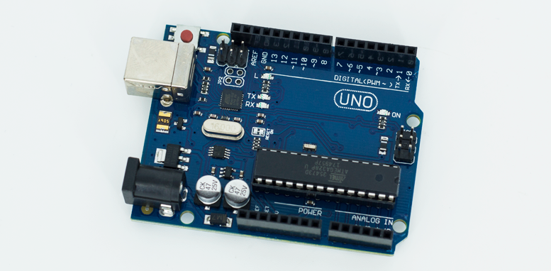
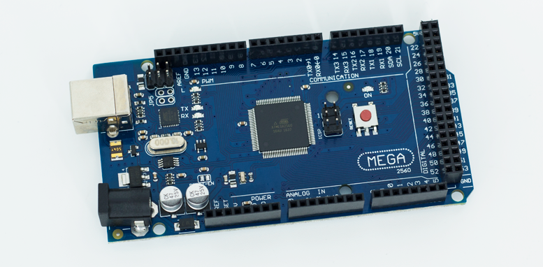
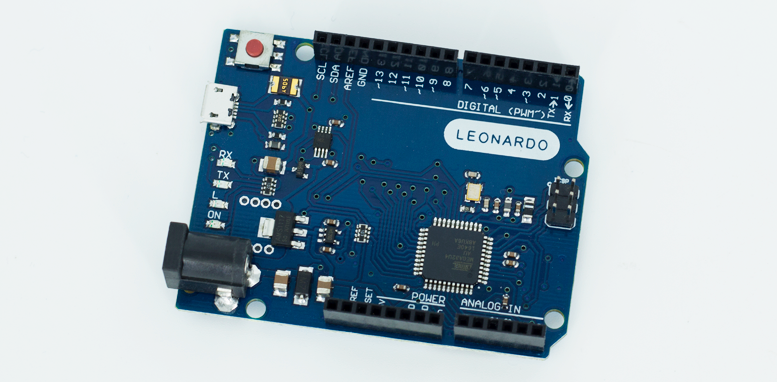
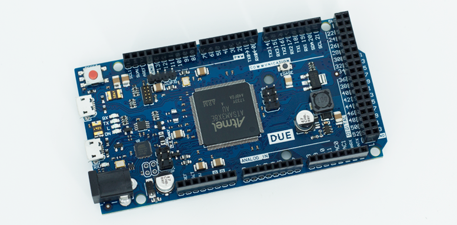
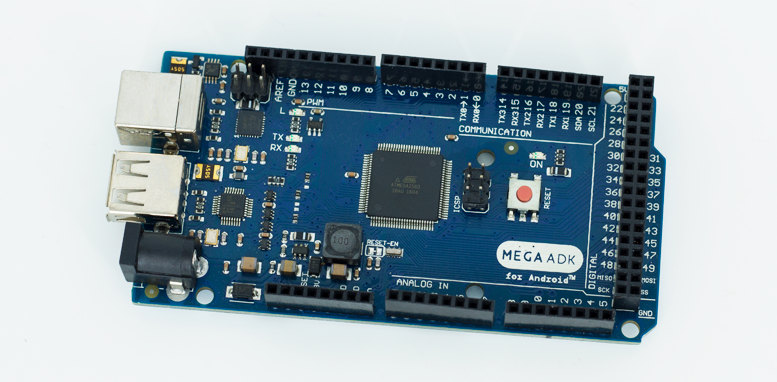
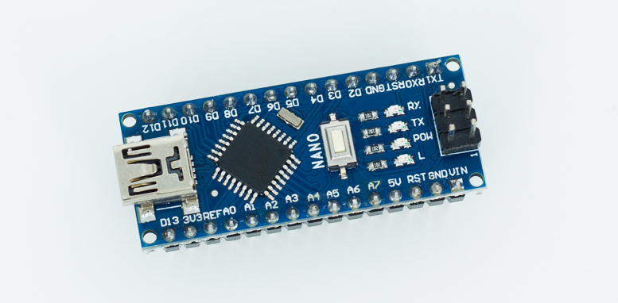
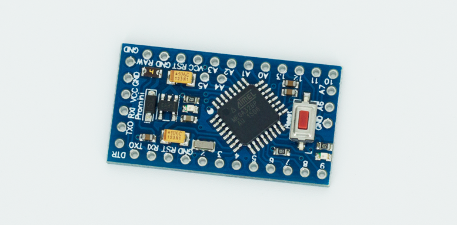

## Arduino
O Arduino é uma plataforma para prototipagem de circuitos eletrônicos.

## Tipos

### Arduino UNO
- Microcontrolador ATMEGA328
- 14 portas digitais (6 podem ser usadas como saída PWM)
- 6 portas analógicas
- Alimentação por cabo USB ou pelo conector para alimentação externa (7 à 12 Vdc)
- Mais detalhes: https://store.arduino.cc/usa/arduino-uno-rev3

### Arduino Mega 2560
- Microcontrolador ATmega2560
- 54 portas digitais (15 podem ser usadas como saída PWM)
- 15 portas analógicas
- Clock de 16 Mhz
- Alimentação por cabo USB ou pelo conector para alimentação externa (7 à 12 Vdc)
- Mais detalhes: https://store.arduino.cc/usa/mega-2560-r3

### Arduino Leonardo
- Microcontrolador Atmega32u4
- 20 portas digitais (7 podem ser usadas como saída PWM)
- 12 portas analógicas
- Clock de 16 Mhz
- Alimentação por cabo microUSB ou pelo conector para alimentação externa (7 à 12 Vdc)
- Mais detalhes: https://store.arduino.cc/usa/leonardo

### Arduino Due
- Microcontrolador ARM de 32 bits
- 512 Kb de memória para programas/aplicações
- 54 portas digitais (12 podem ser usadas como saída PWM)
- 12 portas analógicas
- 4 chips controladores de portas seriais
- Alimentação por cabo microUSB ou pelo conector para alimentação externa (7 à 12 Vdc)
- Mais detalhes: https://store.arduino.cc/usa/due

### Arduino Mega ADK
- Microcontrolador ATmega2560
- 54 porta digitais (15 podem ser usadas como saída PWM)
- 16 portas analógicas
- 4 chips dedicados à comunicação serial
- Clock de 16 Mhz
- Alimentação por cabo microUSB ou pelo conector para alimentação externa (7 à 12 Vdc)
- Mais detalhes: https://store.arduino.cc/usa/arduino-mega-adk-rev3

### Arduino Nano
- Microcontrolador ATmega328 (para versão 3.x) ou ATmega168 (para versão 2.x)
- 32 Kb de memória (versão 3.0) ou 16 Kb (versão 2.0)
- 14 portas digitais
- 8 portas analógicas
- Mais detalhes: https://store.arduino.cc/usa/arduino-nano

### Arduino Pro Mini
- Microcontrolador ATmega168 (8 Mhz para versão 3.3v ou 16 Mhz para versão 5v).
- 14 portas digitais
- 8 portas analógicas
- Não possui conexão USB ou conector para alimentação externa
- Mais detalhes: https://store.arduino.cc/usa/arduino-pro-mini

