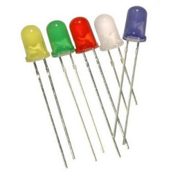
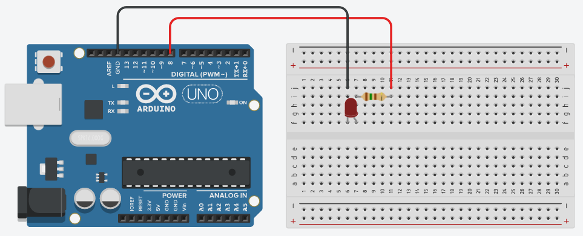

## Sobre
Exemplo de como fazer um LED difuso piscar.

### LED
- Acrônimo para Light-Emitting Diode
- Quando energizado emite luz
- Polarizado
- Diversas cores

### Materiais para o projeto
* 1 Arduino UNO
* 1 Protoboard
* 1 LED difuso 5mm vermelho
* 1 Resistor 150R (marrom-verde-marrom)
* 2 jumpers macho-macho

### Esquema do projeto

### Tinkercad
https://www.tinkercad.com/things/igMwrqPkFIm?sharecode=39DliqMstuypXGCGp7FLyQoGFaMQ7Da7O4bt-JYuYtU
