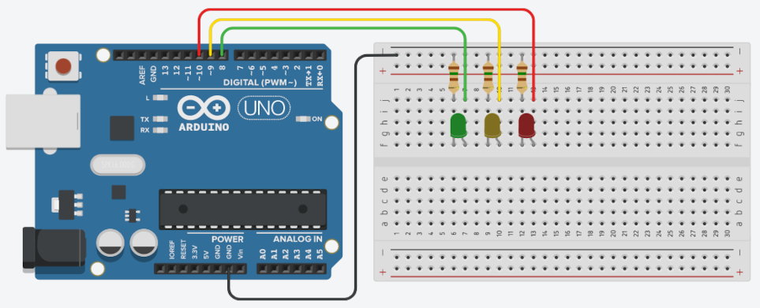

## Sobre
Exemplo de como utilizar LEDs difusos para simular um semáforo.

### Materiais para o projeto
* 1 Arduino UNO
* 1 Protoboard
* 1 LED difuso 5mm verde
* 1 LED difuso 5mm amarelo
* 1 LED difuso 5mm vermelho
* 3 Resistores 150R (marrom-verde-marrom)
* 4 jumpers macho-macho

### Esquema do projeto

