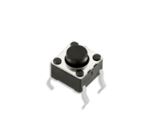
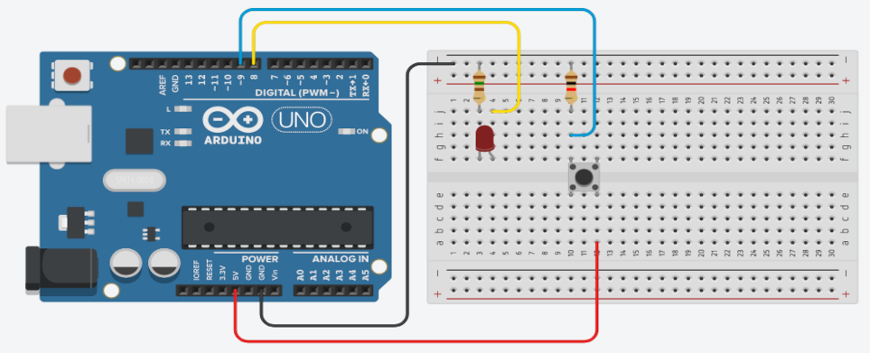

## Sobre
Exemplo de como utilizar push button para simular um interruptor de luz.

### Push button

### Materiais para o projeto
* 1 Arduino UNO
* 1 Protoboard
* 1 LED difuso 5mm verde
* 1 Resistor 150R (marrom-verde-marrom)
* 1 Push button
* 1 Resistor 10K (marrom-preto-laranja)
* 4 jumpers macho-macho

### Esquema do projeto

