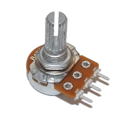
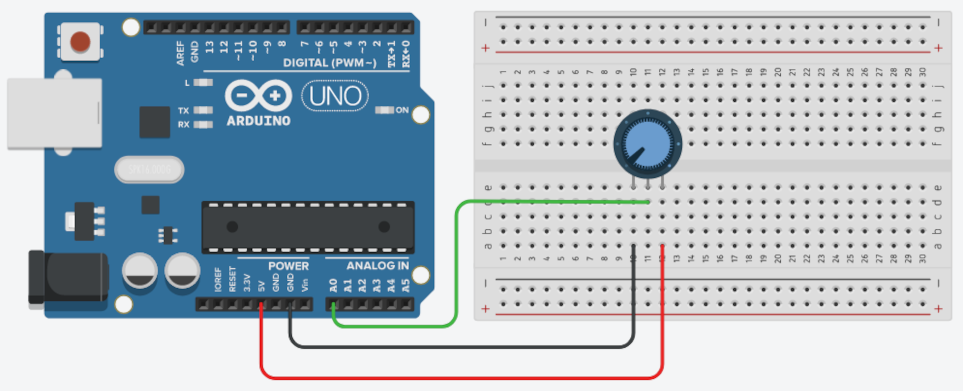

## Sobre
Exemplo de como monitorar valores do potenciômetro linear.

### Potenciômetro

### Materiais para o projeto
* 1 Arduino UNO
* 1 Protoboard
* 1 Potenciômetro linear 10K
* 3 jumpers macho-macho

### Esquema do projeto

