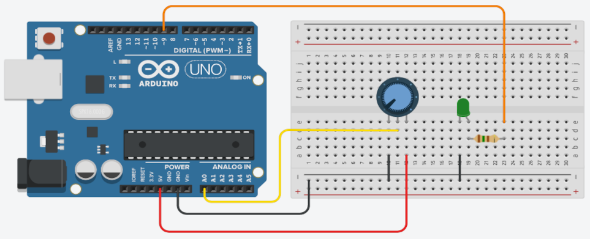

## Sobre
Exemplo de como utilizar potenciômetro linear para controlar a intensidade do LED.

### Materiais para o projeto
* 1 Arduino UNO
* 1 Protoboard
* 1 Potenciômetro linear 10K
* 1 LED difuso 5mm verde
* 1 Resistor 150R (marrom-verde-marrom)
* 6 jumpers macho-macho

### Esquema do projeto

### Tinkercad
https://www.tinkercad.com/things/jnxJCBcwup0?sharecode=2chzYY7TCf7vGcqW4mXbEC27KuHKcTmNyYXvJNoEfEY