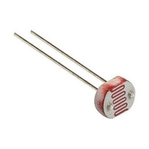
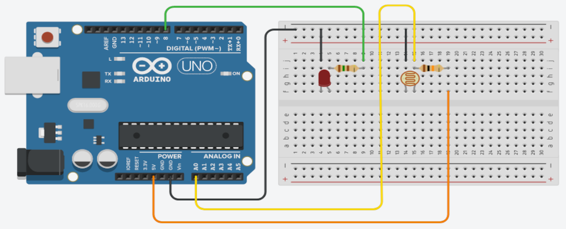

## Sobre
Exemplo de como utilizar um LDR.

### LDR

### Materiais para o projeto
* 1 Arduino UNO
* 1 Protoboard
* 1 LDR
* 1 Resistor 10K (marrom-preto-laranja)
* 1 LED difuso 5mm verde
* 1 Resistor 150R (marrom-verde-marrom)
* 6 jumpers macho-macho

### Esquema do projeto

