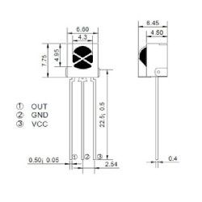

## Sobre
Exemplo de como utilizar um IR_VS1838 para identificar códigos de controles remoto.

### IR VS1838

### Materiais para o projeto
* 1 Arduino UNO
* 1 Protoboard
* 1 IR_VS1838
* 3 jumpers macho-macho

### Esquema do projeto

### Tinkercad
https://www.tinkercad.com/things/bZrVSe0HLWC?sharecode=QLw9EoSOvxCJrlwlbd_i9LKtvSWUyzxXetpzYp8jgls
