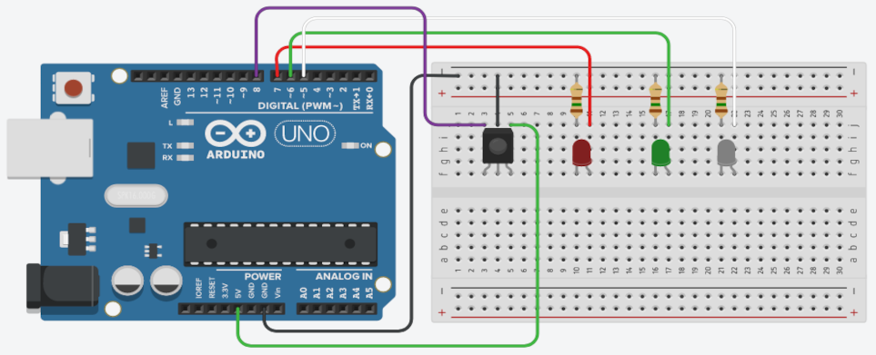

## Sobre
Exemplo de como utilizar um IR_VS1838 para ligar LEDs.

### Materiais para o projeto
* 1 Arduino UNO
* 1 Protoboard
* 1 IR_VS1838
* 1 LED difuso 5mm vermelho
* 1 LED difuso 5mm verde
* 1 LED difuso 5mm azul
* 3 Resistores 150R
* 1 Controle remoto com cores
* 7 jumpers macho-macho

### Esquema do projeto

