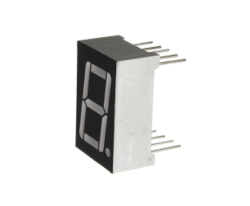
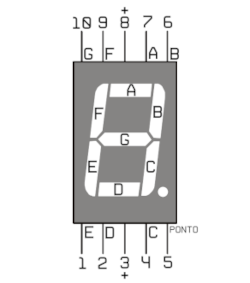
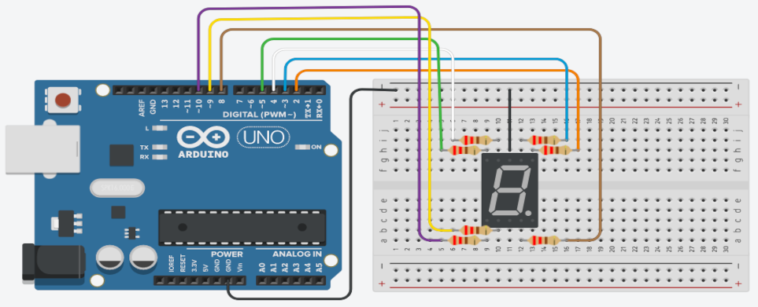

## Sobre
Exemplo de como utilizar display 7 segmentos 1 dígito.

### Display 7 segmentos

### Materiais para o projeto
* 1 Arduino UNO
* 1 Protoboard
* 1 Display 7 segmentos 1 dígito
* 7 Resistores 220R
* 9 jumpers macho-macho

### Esquema do projeto

