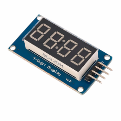

## Sobre
Exemplo de como utilizar display 7 segmentos 4 digitos TM1637.

### Display 7 segmentos

### Materiais para o projeto
* 1 Arduino UNO
* 1 Display 7 segmentos 4 dígitos TM1637
* 4 jumpers macho-fêmea

