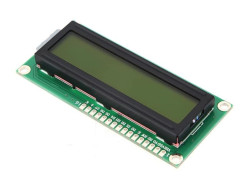
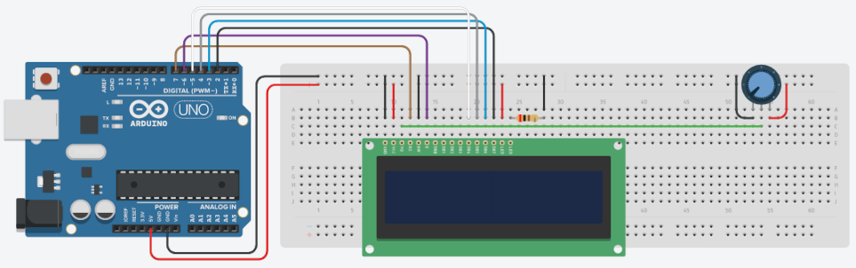

## Sobre
Exemplo de como utilizar display LCD 16x2.

### Display LCD 16x2

### Materiais para o projeto
* 1 Arduino UNO
* 1 Protoboard
* 1 Display LCD
* 1 Potenciômetro linear 10K
* 1 Resistor 200R (vermelho-preto-marrom)
* 16 jumpers macho-macho

### Esquema do projeto

