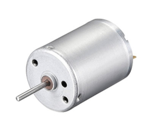
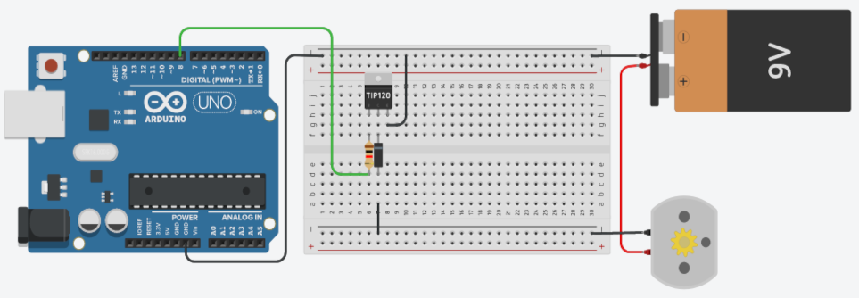

## Sobre
Exemplo de como acionar um motor DC.

### Motor DC

### Materiais para o projeto
* 1 Arduino UNO
* 1 Protoboard
* 1 Transistor TIP 120 (ou equivalente)
* 1 Diodo 1N4007 (ou equivalente)
* 1 Resistor 1K (marrom-preto-vermelho)
* 1 Motor DC
* 1 Fonte 9V
* 5 jumpers macho-macho

### Esquema do projeto

### Tinkercad
https://www.tinkercad.com/things/7RNRkD5rONq?sharecode=YN2Z911YxMiWBntShmnq3i1aLacCAErNtdAedM_DMDM
