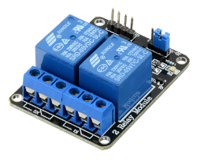
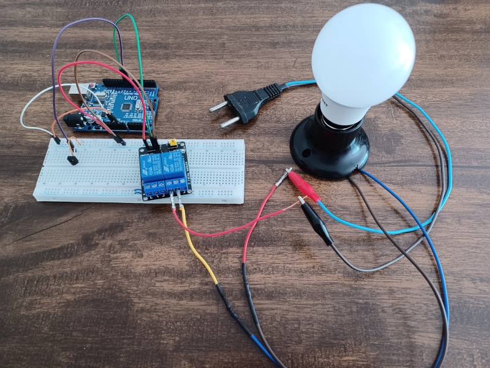
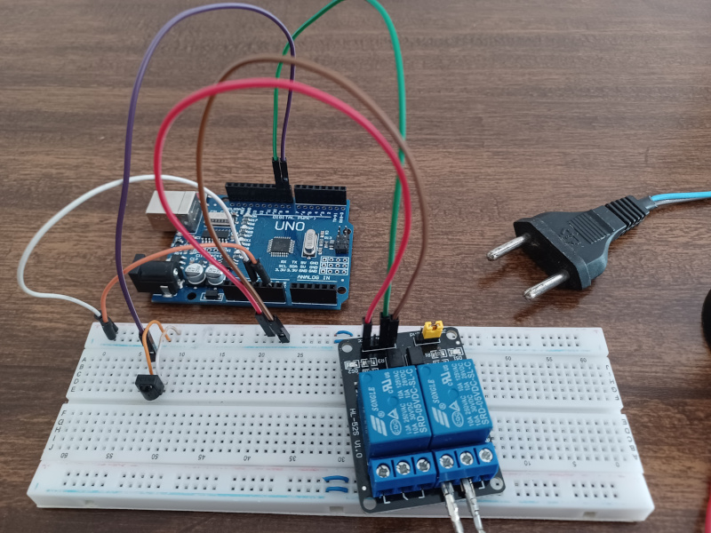

## Sobre
Exemplo de como ligar uma lâmpada usando módulo relé 5v 2 canais.

### Motor DC

### Materiais para o projeto
* 1 Arduino UNO
* 1 Protoboard
* 1 Módulo relé 5c 1 canal (ou 2 canais)
* 1 Bocal para lâmpada
* 1 Lâmpada
* 1 Controle remoto
* 1 Infravermelho VS1838
* 3 Jumpers macho-fêmea
* 5 Jumpers macho-macho
* 3 Pedaços pequeno fios

### Esquema do projeto

